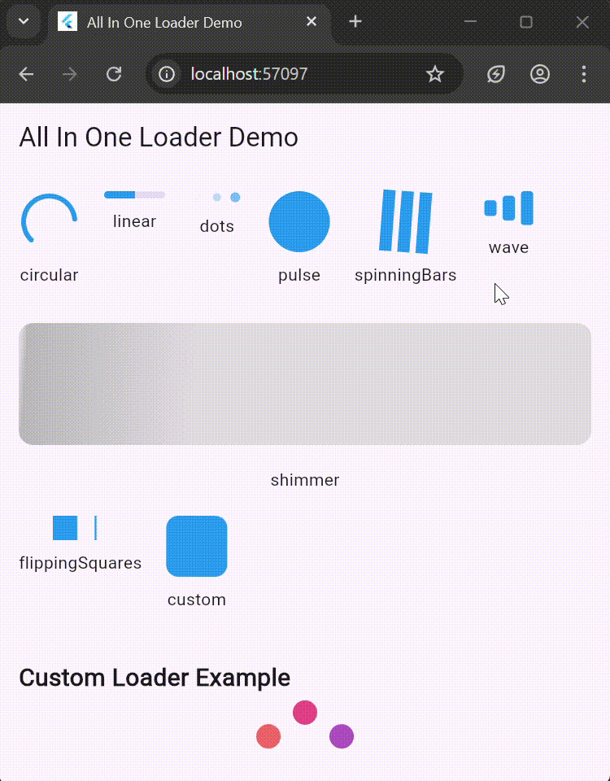

### All In One Loader

A fully customizable, all-in-one loader widget for Flutter.
Includes multiple loader types (circular, linear, dots, pulse, spinning bars, wave, shimmer, flipping squares) and first-class support for custom animations, gradients, determinate progress, and small per-loader config objects to keep the API tidy.





### Installation (from pub.dev)

Add the package to your app pubspec.yaml dependencies:

```bash
dependencies:
  all_in_one_loader: ^0.0.1
```
Then fetch packages:

```bash
flutter pub get
```
Import in your Dart files:

```bash
import 'package:all_in_one_loader/all_in_one_loader.dart';
import 'package:all_in_one_loader/loader_type.dart';
```

### Quick usage

```bash
AllInOneLoader(
  type: LoaderType.circular,
  size: 80,
  color: Colors.blue,
  duration: Duration(seconds: 2),
  circularConfig: const CircularLoaderConfig(
    strokeWidth: 6.0,
    showPercentage: true,
  ),
);
```

### Overview of the widget

AllInOneLoader is the single entry point:

```bash
AllInOneLoader({
  required LoaderType type,
  double size = 50.0,
  Color? color,
  Duration duration = const Duration(seconds: 1),
  Gradient? gradient,
  bool loop = true,
  bool showDemo = false,
  ShimmerLayoutType? shimmerType,
  LoaderBuilder? customBuilder,
  CircularLoaderConfig? circularConfig,
  LinearLoaderConfig? linearConfig,
  DotsLoaderConfig? dotsConfig,
  PulseLoaderConfig? pulseConfig,
})
```
- type — which loader to render (see LoaderType enum).

- size — width/height used by most loaders.

- color — base color for loaders that use a single color.

- gradient — gradient to apply when a loader supports it.

- duration — animation cycle length.

- loop — true for repeating animation; set false if you want it to run once.

- showDemo — shows all loaders (handy for documentation screens).

- customBuilder — provide custom animation with access to the AnimationController.

- Per-loader config objects (described below) let you fine-tune behavior.

### Per-loader configs & detailed API

All config classes are immutable and simple to construct. Use them to keep your AllInOneLoader call compact.

### Circular loader — CircularLoaderConfig

```bash
const CircularLoaderConfig({
  double? progress,          // 0.0 - 1.0; if set, loader is determinate
  double strokeWidth = 4.0,
  bool showPercentage = false,
  Color? backgroundColor,    // track color (behind the progress)
  Color? color,              // overrides top-level color if provided
  StrokeCap strokeCap = StrokeCap.round,
});

```
Notes & examples

 - Indeterminate spinner (default):
     - 
```bash
    AllInOneLoader(type: LoaderType.circular, size: 60);
```
 - Determinate with percentage:
     - 
```bash
    AllInOneLoader(
        type: LoaderType.circular,
        size: 100,
        circularConfig: const CircularLoaderConfig(
        progress: 0.65,
        strokeWidth: 8.0,
        showPercentage: true,
        backgroundColor: Colors.grey,
        ),
    );
```


